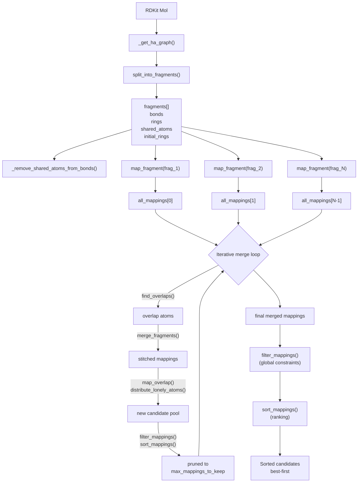

# Partitioning Workflow — `partitioning.py`

This module decomposes a molecule into coarse-grained (CG) beads — groups of
2–4 heavy atoms that form the Martini mapping. The core entry point is
**`generate_mappings`**, which orchestrates a three-stage pipeline:
fragmentation → per-fragment enumeration → stitching + filtering.

---

## Table of Contents

1. [Big Picture](#big-picture)
2. [Stage 0 — Molecule Preprocessing & Fragmentation](#stage-0--molecule-preprocessing--fragmentation)
3. [Stage 1 — Per-Fragment Mapping (`map_fragment`)](#stage-1--per-fragment-mapping-map_fragment)
4. [Stage 2 — Fragment Stitching (`generate_mappings` merge loop)](#stage-2--fragment-stitching-generate_mappings-merge-loop)
5. [Stage 3 — Global Filtering & Sorting](#stage-3--global-filtering--sorting)
6. [Utility Helpers](#utility-helpers)
7. [Data Flow Diagram](#data-flow-diagram)

---

## Big Picture

```
Molecule (RDKit Mol)
        │
        ▼
┌──────────────────────────────┐
│  Stage 0: Fragment molecule   │   split_into_fragments()
│  into overlapping subgraphs   │
└──────────────┬───────────────┘
               │  fragments[], bonds, rings
               ▼
┌──────────────────────────────┐
│  Stage 1: Per-fragment map   │   map_fragment() × N
│  anchor → bead enumeration   │
└──────────────┬───────────────┘
               │  all_mappings[][]
               ▼
┌──────────────────────────────┐
│  Stage 2: Progressive merge  │   merge_fragments()
│  along overlap atoms         │   (iterative pairwise)
└──────────────┬───────────────┘
               │  merged_mappings[]
               ▼
┌──────────────────────────────┐
│  Stage 3: Filter + Sort      │   filter_mappings()
│  apply constraints, rank     │   sort_mappings()
└──────────────┬───────────────┘
               │
               ▼
   Final candidate mappings
   (sorted, best-first)
```

**Why fragments?** Enumerating all bead assignments on an entire molecule is
combinatorially explosive. By splitting at chemically meaningful boundaries
(rings, branching points) and solving locally, the search stays tractable.
Overlaps between fragments are then reconciled during stitching.

---

## Stage 0 — Molecule Preprocessing & Fragmentation

### `_get_ha_graph(molecule)`

Strips hydrogens and builds the **heavy-atom graph** — the backbone of all
subsequent logic.

| Output | Description |
|--------|-------------|
| `atoms` | List of RDKit heavy atoms (Z > 1) |
| `bonds` | List of `[i, j]` undirected heavy-atom bonds |

> Partitioning is done on heavy atoms only. Hydrogens are added back later by
> the topology builder.

### `split_into_fragments(molecule)`

Decomposes the molecule into overlapping subgraphs. Returns
`(fragments, frag_ranks, rings, shared_atoms, initial_rings)`.

**Sub-steps:**

1. **`fuse_rings(molecule)`** — Detects all rings via `GetRingInfo().AtomRings()`,
   discards rings larger than `CFG.max_ring_len`, then fuses rings that share
   atoms into ring *systems*. Overlap atoms between fused rings are tracked as
   `shared_atoms`.

2. **Build ring fragments** — Each fused ring system is expanded to include its
   nearest heavy-atom neighbors. Shared atoms are removed so that the overlap
   between ring fragments is **at most 1 atom per connection** (critical for
   consistent stitching later).

3. **Build linear fragments** — Non-ring branching atoms (degree > 1) become
   seeds for linear fragments. Each seed + its neighbors (excluding ring atoms)
   form a fragment. Fragments with ≤ 2 atoms are rejected (too small, would
   over-constrain mapping).

4. **Assign leftovers** — Any atom not yet in a fragment is assigned to the
   nearest fragment containing one of its neighbors.

5. **Validate** — Every heavy atom must belong to at least one fragment.

### `_remove_shared_atoms_from_bonds(bonds, shared_atoms)`

Drops bonds that are **fully inside** inter-fragment overlap regions. Keeping
these bonds can over-constrain local anchor selection and lead to inconsistent
bead assignment across fragments.

---

## Stage 1 — Per-Fragment Mapping (`map_fragment`)

```python
map_fragment(fragment, atoms, bonds, initial_rings) → list[list[list[int]]]
```

Enumerates all feasible bead mappings for a single fragment.

### 1a. Bead Count Range — `get_min_max_beads(fragment, atoms)`

Determines how many beads the fragment should be split into, based on chemistry:

| Fragment type | Min beads | Max beads |
|---------------|-----------|-----------|
| Aromatic | ⌊n/3⌋ | ⌊n/2⌋ |
| In ring (non-aromatic) | ⌈n/3⌉ | ⌊n/2⌋ |
| Linear | ⌊n/4⌋ (min 1) | ⌊n/2⌋ + 1 |

> Aromatic and ring fragments get larger minimum beads (3–4 atoms) reflecting
> Martini's coarse-graining conventions for rigid motifs.

### 1b. Anchor Enumeration — `find_anchors(fragment, bonds, nbeads)`

For a given number of beads `nbeads`:

1. Generate **all combinations** of `nbeads` atoms from the fragment
   (`itertools.combinations`).
2. Filter to **acceptable** combinations via the Cython-optimized
   `opcy.find_acceptable_combinations`, which checks that the chosen anchors
   are connectivity-consistent with the fragment's bond graph.

### 1c. Bead Expansion — `find_no_overlap_mappings(combs, fragment)`

For each acceptable anchor combination:

1. **Expand** each anchor atom `i` into a provisional bead `[i] + neighbors(i)`.
2. **Check coverage** — every atom in the fragment must belong to at least one
   bead.
3. **Resolve overlaps** via `distribute_neis(mapping)` — if two beads share an
   atom, generate alternative assignments where the shared atom is assigned to
   one bead and removed from the other (provided the stripped bead still has
   ≥ 2 atoms).

### 1d. Overlap Resolution — `distribute_neis(mapping)`

Given a mapping where beads may overlap:

```
For each pair of beads (i, j):
    If they share atoms:
        Option A: remove overlap from bead i (keep if |bead_i| > 1)
        Option B: remove overlap from bead j (keep if |bead_j| > 1)
    If no overlap: keep as-is
```

This generates a branching tree of alternative non-overlapping assignments.
Only mappings where every bead has ≥ 2 atoms survive.

### 1e. Ring Symmetry Filter — `filter_out_non_symmetrizable_mappings(mappings, ring)`

Applied when `CFG.symmetrize_rings` is set. For each candidate mapping:

> If **any** atom in a bead belongs to the target ring, then **all** atoms in
> that bead must belong to the ring.

Mappings where a bead straddles the ring boundary (some atoms inside, some
outside) are discarded. This ensures rings can be symmetrized cleanly.

---

## Stage 2 — Fragment Stitching (`generate_mappings` merge loop)

### 2a. Find Overlaps — `find_overlaps(frag, other_frags)`

Given a merged fragment and the list of remaining fragments, finds the next
fragment that shares atoms with the merged one. Returns the other fragment,
its index, and the set of overlap atoms.

> The overlap should contain **exactly 1 atom per inter-fragment connection**,
> enforced by the fragment-building step in Stage 0.

### 2b. Merge Two Fragment Mappings — `merge_fragments(m1, m2, overlaps)`

Stitches two fragment mappings along their overlap atoms:

1. **Concatenate** the two mappings into one combined list of beads.
2. For each overlap atom:
   - Find the **two beads** (one from each fragment) that contain the overlap.
   - Remove both beads; call `map_overlap()` to redistribute their atoms.
   - Stitch the redistributed beads back into the mapping.
3. **`distribute_lonely_atoms(mappings)`** — After stitching, if any bead has
   only 1 atom, move that atom into a neighboring bead.

### 2c. Overlap Redistribution — `map_overlap(beads, overlap)`

Given two overlapping beads `[b1, b2]` that share atom `overlap`:

| Case | Action |
|------|--------|
| Combined bead has ≤ 3 atoms | Merge into a single bead |
| `b1 \ {overlap}` is non-empty & connected | Keep `b1` without overlap, leave `b2` intact |
| `b2 \ {overlap}` is non-empty & connected | Keep `b2` without overlap, leave `b1` intact |

Returns 1–3 alternative bead assignments for the overlap region.

### 2d. Iterative Stitching Loop

```python
merged_mappings = mappings_of_fragment_0
for each remaining fragment:
    find overlap
    for m1 in top merged_mappings:          # capped at max_mappings_to_keep
        for m2 in mappings_of_next_fragment:
            stitch = merge_fragments(m1, m2, overlap)
            add stitch to new_mappings
    filter + sort new_mappings
    merged_mappings = new_mappings
```

The `max_mappings_to_keep` cap (default 500) is critical: it **prunes** the
candidate pool at each merge step to prevent combinatorial explosion as
fragments are combined.

---

## Stage 3 — Global Filtering & Sorting

### `filter_mappings(mappings, molecule, fused_rings, ...)`

Applies **hard structural constraints** in a cascading order (each step only
applies if candidates remain):

| Step | Constraint | Config |
|------|-----------|--------|
| 1 | No single-atom beads | (always) |
| 2 | No bead larger than `max_bead_size` | `CFG.max_bead_size` (default 4) |
| 3 | Keep rings together — no mixed ring/non-ring beads | `CFG.keep_rings_together` |
| 4 | Fully-ring beads ≤ `max_ring_bead_size` | `CFG.max_ring_bead_size` (default 3) |
| 5 | Remove duplicate mappings | (always) |

> Steps are **progressive**: if after step 2 only one mapping remains, steps
> 3–5 are skipped. This preserves at least one valid mapping.

**Step 3 detail (`ring_beads_are_together`):** For each ring, if a bead contains
*any* ring atom, it must contain *only* ring atoms. This is the same logic as
`filter_out_non_symmetrizable_mappings` but applied globally to the final
merged mappings.

### `sort_mappings(mappings, molecule, fused_rings)`

Ranks candidates by a **multi-criteria sort key** (minimized):

```python
sort_key = (num_beads, num_terminal_nonring_beads, num_tiny_ring_beads)
```

| Criterion | Meaning | Preference |
|-----------|---------|------------|
| `num_beads` | Total bead count | **Fewer** beads = coarser graining (better) |
| `num_terminal_nonring_beads` | Beads at molecular termini that are not in rings | Fewer is better (avoids fragmenting chain ends) |
| `num_tiny_ring_beads` | Size-2 beads fully inside a ring | Fewer is better (avoids over-fragmenting rigid rings) |

> Sorted in **ascending** order (lower score = better), so the best mapping is
> `mappings[0]`.

---

## Utility Helpers

### `flat_set(lst)`

Flattens a list-of-lists into a single `set` of unique elements. Used
everywhere for membership checks (e.g., "is this atom in any fragment?").

### `sort_nested(lst)`

Canonically sorts a nested list: `sorted([sorted(sublist) for sublist in lst])`.
Used for deduplication and consistent comparison of mappings.

---

## Data Flow Diagram



---

## Key Configuration Parameters

| Parameter | Default | Effect |
|-----------|---------|--------|
| `CFG.max_bead_size` | 4 | Maximum heavy atoms per bead |
| `CFG.max_ring_bead_size` | 3 | Maximum heavy atoms for a bead fully inside a ring |
| `CFG.keep_rings_together` | `True` | Forbid beads that mix ring and non-ring atoms |
| `CFG.max_ring_len` | 12 | Rings larger than this are treated as linear chains |
| `CFG.max_mappings_to_keep` | 500 | Pruning cap during iterative stitching |
| `CFG.max_combs_merged` | 1000 | Max anchor combinations considered per merge step |
| `CFG.symmetrize_rings` | `False` | Enforce ring-symmetry constraints on specific rings |
