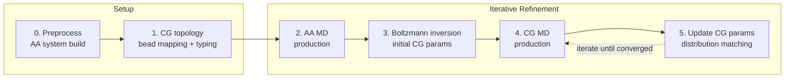
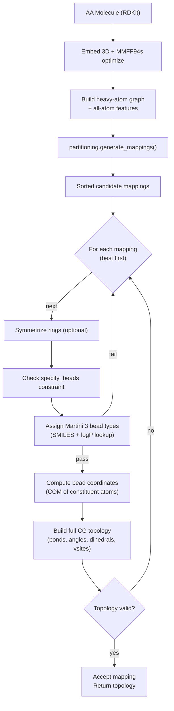

# SMartini: Methods

## Overview

SMartini is an automated pipeline for deriving Martini 3 coarse-grained (CG)
force-field parameters for arbitrary small molecules. Starting from an SDF
structure or SMILES string, the workflow maps the all-atom (AA) molecule onto
a CG bead representation, refines bonded parameters using AA and CG molecular
dynamics (MD) trajectories, and iteratively updates the CG topology until
convergence.

The pipeline is implemented as a sequence of six scripts (`0`–`5`) that can be
run independently or orchestrated via `run.sh` on HPC clusters. The core
scientific components are the **partitioning** engine (fragment-based bead
mapping) and the **solver** (bead-type assignment and topology construction).

---

## General Strategy

### Step 0 — Ligand Preprocessing (`0_preprocess_ligand.py`)

**Purpose:** Build a solvated all-atom system and generate topology files for
the AA simulation.

1. **Read the ligand** from its SDF file using the OpenFF Toolkit.
2. **Assign force-field parameters** via SMIRNOFF (OpenFF 2.1.0) for the
   ligand and Amber19 + OPC for the solvent.
3. **Solvate** the ligand in a rhombic dodecahedron box with OPC water, adding
   Na⁺/Cl⁻ counterions to neutralise the system.
4. **Create the OpenMM System** (PME electrostatics, 1.0 nm cutoff, HBonds
   constraints, rigid water) and serialise it to XML.
5. **Write** `system.pdb`, `system.xml`, and a reduced `md.pdb` (solute only)
   for downstream trajectory referencing.
6. **Report ligand chemical properties** (formula, molecular weight, logP,
   rotatable bonds, H-bond donors/acceptors, TPSA, and ring atom lists) to
   screen and `info.txt`.

**Outputs:** `aa_md/system.pdb`, `aa_md/system.xml`, `aa_md/md.pdb`,
`info.txt`.

---

### Step 1 — CG Topology Generation (`1_gen_cg_topo.py`)

**Purpose:** Derive the initial CG bead mapping, assign Martini 3 bead types,
and write the CG topology.

1. **Load the AA molecule** from the SDF file (or SMILES), embed 3D
   coordinates, and optimise with UFF.
2. **Invoke the solver** (`smartini.solver.CG_molecule`) which:
   - Enumerates candidate bead mappings via the partitioning engine.
   - Assigns Martini 3 bead types using per-bead SMILES extraction and logP
     lookup.
   - Computes bead coordinates as the centre of geometry of the constituent
     atoms.
   - Builds the full CG topology (bonds, angles, dihedrals, virtual sites).
   - Accepts the first mapping that passes all validation checks.
3. **Write output files:**
   - `{molname}_initial.itp` — GROMACS topology include file with initial
     bonded parameters from Martini 3 rules.
   - `{molname}.pdb` — CG bead structure.
   - `{molname}.map` — atom-to-bead index mapping.

**Outputs:** `{molname}_initial.itp`, `{molname}.pdb`, `{molname}.map`,
`{molname}_aa.pdb`.

---

### Step 2 — All-Atom MD (`2_aa_md.py`)

**Purpose:** Run an AA MD simulation of the solvated ligand to sample the
reference conformational ensemble.

1. **Load** the pre-built OpenMM system from `system.xml` and `system.pdb`.
2. **Minimise** energy (1000 steps).
3. **Heat** from 0 K to the target temperature over 10 000 steps in a linear
   ramp.
4. **Equilibrate** with a Monte Carlo barostat at the target temperature and
   pressure for 10 000 steps.
5. **Produce** an NPT trajectory with a Langevin integrator, writing frames to
   `md.xtc` and thermodynamic logs to `md.log`.
6. **Post-process** the trajectory: fit the solute to itself
   (rotational/translational alignment) and write aligned samples to
   `samples.xtc` and `topology.pdb`.

**Outputs:** `aa_md/md.xtc`, `aa_md/md.log`, `aa_md/samples.xtc`,
`aa_md/topology.pdb`.

---

### Step 3 — Boltzmann Inversion (`3_boltz_inv.py`)

**Purpose:** Derive initial CG bonded parameters directly from the AA
trajectory using Boltzmann inversion.

1. **Read the AA trajectory** and compute internal coordinates (bond lengths,
   angles, dihedrals) for the atom groups that correspond to each CG bead.
2. **Fit bond parameters** — for each CG bond and constraint, compute the
   potential of mean force (PMF) from the AA distance distribution:
   $$U(r) = -k_B T \ln P(r)$$
   Fit a harmonic potential $U(r) = \frac{1}{2} k (r - r_0)^2$ to the PMF.
3. **Fit angle parameters** — for each CG angle:
   - Linear, non-ring 3-bead fragments → **type-1** harmonic angle.
   - All other angles → **type-10** restricted bending (with a flat-bottomed
     well and harmonic walls); falls back to type-1 for near-linear or
     weakly constrained angles.
4. **Fit dihedral parameters** — for each CG dihedral:
   - **Type-9** (periodic Fourier series) with multiplicities inherited from
     the initial topology.
   - **Type-11** (cosine-based torsion, CBT) for selected torsions.
5. **Write** the updated ITP file with all fitted parameters.

**Outputs:** `{molname}.itp` (updated with Boltzmann-inverted parameters).

---

### Step 4 — CG MD (`4_cg_md.py`)

**Purpose:** Run a Martini 3 CG simulation of the solvated CG molecule.

1. **Build the CG system:**
   - Copy the CG bead structure and topology ITP to the run directory.
   - Solvate with Martini water beads (`water.gro`) to a 0.17 nm radius.
   - Add Na⁺/Cl⁻ counterions if an `ions.mdp` template is present.
   - Generate GROMACS index groups (System, Solute, Backbone, Solvent).
   - Write the `system.top` master topology including all Martini 3.0 force
     field includes.
2. **Energy-minimise** the system (steepest descent).
3. **Run production NPT** MD with a 20 fs timestep, using the Verlet cutoff
   scheme and the Martini 3 non-bonded parameters.
4. **Extract** the solute trajectory and topology (rotational/translational
   fitting) as `samples.xtc` and `topology.pdb`.

**Outputs:** `cg_md/mdrun/samples.xtc`, `cg_md/mdrun/topology.pdb`,
`cg_md/system.top`.

---

### Step 5 — Iterative Parameter Update (`5_cgmd_upd.py`)

**Purpose:** Refine CG bonded parameters by matching AA and CG conformational
distributions.

This step is run **iteratively** after Step 4 until the CG ensemble
reproduces the AA target distributions within tolerance.

1. **Compute internal coordinates** from both the AA reference trajectory
   (Step 2) and the CG trajectory (Step 4).
2. **Update bonds and constraints:**
   $$r_0^{\text{new}} = r_0^{\text{old}} + \alpha (\mu_{\text{AA}} - \mu_{\text{CG}})$$
   $$k^{\text{new}} = k^{\text{old}} \cdot \left(\frac{\sigma_{\text{CG}}}{\sigma_{\text{AA}}}\right)^2$$
   where $\alpha$ is a learning rate (`alpha_max`) and $\mu$, $\sigma$ are
   the mean and standard deviation of the sampled distributions.
3. **Update angles** — same shift-and-rescale logic as bonds, with equilibrium
   values clamped to $[0^\circ, 180^\circ]$ and force constants bounded by
   configurable lower/upper limits.
4. **Update dihedrals** — for each torsion key:
   - Compute the AA target PMF and the CG current PMF.
   - Build a correction PMF: $\Delta U(\phi) = -k_B T \ln(\rho_{\text{AA}} / \rho_{\text{CG}})$.
   - Re-fit the type-9 (Fourier) or type-11 (CBT) functional form to the
     combined existing-potential + correction surface.
5. **Overwrite** the ITP file. The updated parameters are used in the next
   iteration of Step 4.

**Outputs:** Updated `{molname}.itp`, diagnostic PMF plots in `tmp/png/`.

---

## Partitioning Engine

The partitioning engine (`package/smartini/partitioning.py`) is the
computational core of the CG mapping step. It solves the combinatorial
problem of assigning $N$ heavy atoms to $M$ CG beads while respecting
chemical connectivity, ring integrity, and bead-size constraints.

### Problem Formulation

Given a molecular graph $G = (V, E)$ of heavy atoms, find a partition of $V$
into $M$ disjoint subsets (beads) $B_1, \ldots, B_M$ such that:

- Each bead $B_k$ is a connected subgraph of $G$.
- $2 \leq |B_k| \leq 4$ (Martini 3 bead size limits).
- For ring-local beads: $|B_k| \leq 3$.
- If a bead contains any ring atom, it must contain **only** ring atoms (ring
  integrity constraint when `CFG.keep_rings_together = True`).
- Every atom belongs to exactly one bead ($\bigcup_k B_k = V$,
  $B_i \cap B_j = \emptyset$).

### Fragment-Map-Merge Strategy

Enumerating all $M$-partitions directly on the full molecular graph is
combinatorially explosive. SMartini uses a **fragment-first** approach:

#### Stage 0 — Fragmentation

The molecule is decomposed into overlapping subgraphs (fragments) centred on
chemically important motifs:

1. **Ring fusion** — all rings (size ≤ 12) are detected via RDKit. Rings that
   share atoms are fused into ring systems.
2. **Ring fragments** — each fused ring system + its nearest heavy-atom
   neighbours forms a ring fragment. Shared atoms between ring fragments are
   removed so overlaps are at most 1 atom per connection.
3. **Linear fragments** — non-ring branching atoms (degree > 1) become seeds;
   each seed + its neighbours (excluding ring atoms) forms a linear fragment.
   Fragments with ≤ 2 atoms are discarded.
4. **Leftover assignment** — any remaining atom is assigned to its nearest
   fragment.

#### Stage 1 — Per-Fragment Enumeration

For each fragment independently:

1. **Bead-count range** is determined from fragment chemistry (aromatic:
   $\lfloor n/3 \rfloor$ to $\lfloor n/2 \rfloor$; ring: $\lceil n/3 \rceil$
   to $\lfloor n/2 \rfloor$; linear: $\lfloor n/4 \rfloor$ to
   $\lfloor n/2 \rfloor + 1$).
2. **Anchor combinations** — for each bead count, all $\binom{n}{k}$
   combinations of anchor atoms are enumerated and filtered to those that are
   connectivity-consistent with the fragment's bond graph (Cython-optimised).
3. **Bead expansion** — each anchor is expanded to `[anchor] + neighbours`.
   Overlapping assignments are resolved by distributing shared atoms between
   competing beads, generating a branching tree of alternative non-overlapping
   mappings.
4. **Ring symmetry filtering** — when ring symmetrisation is requested,
   mappings where a bead straddles a ring boundary (some atoms inside, some
   outside) are discarded.

#### Stage 2 — Progressive Stitching

Fragment mappings are merged pairwise along their overlap atoms:

1. **Find overlaps** — identify the atom(s) shared between the merged fragment
   and the next fragment.
2. **Stitch** — for each overlap atom, locate the two beads (one from each
   fragment) containing it, redistribute their atoms into 1–3 alternative
   bead assignments, and recombine.
3. **Prune** — after each merge, the candidate pool is filtered and sorted,
   capped at `max_mappings_to_keep` (default 500) to prevent combinatorial
   explosion.

#### Stage 3 — Global Filtering & Ranking

The final merged mappings are subjected to hard constraints (in cascading
order):

| Constraint | Threshold |
|---|---|
| No single-atom beads | (always) |
| $|B_k| \leq$ `max_bead_size` | default 4 |
| Keep rings together (no mixed ring/non-ring beads) | `keep_rings_together` |
| Ring beads $\leq$ `max_ring_bead_size` | default 3 |
| Remove duplicates | (always) |

Surviving candidates are ranked by a multi-criteria key that prefers **fewer
total beads**, fewer terminal non-ring beads, and fewer size-2 ring beads.
The solver iterates through the sorted list and accepts the first mapping that
passes bead-type assignment and topology construction.

---

## Solver

The solver (`package/smartini/solver.py`, class `CG_molecule`) orchestrates
the end-to-end CG mapping and topology construction for a single molecule.

### Workflow

### Key Steps

1. **Embed & Optimise** — the AA molecule is embedded in 3D and optimised with
   the MMFF94s force field to obtain a physically reasonable starting geometry.

2. **Feature Extraction** — chemical features (aromaticity, H-bond donors and
   acceptors, ring membership) are extracted using RDKit's feature factory and
   stored for bead-type assignment.

3. **Mapping Enumeration** — calls `partitioning.generate_mappings()` to
   produce a sorted list of candidate bead partitions.

4. **Bead-Type Assignment** (`get_bead_types`) — for each bead:
   - Extract the SMILES string of the bead's constituent atoms.
   - Look up or predict the octanol/water partition coefficient (logP).
   - Map to a Martini 3 bead type (e.g., P1, N0, C5, SN4a, etc.) using the
     standard Martini 3 chemical-type rules based on polarity, hydrogen-bonding
     capability, and ring membership.

5. **Coordinate Computation** — bead positions are set to the centre of mass of
   the underlying heavy atoms (using the MMFF94s-optimised geometry).

6. **Topology Construction** — bonded terms are generated automatically from
   the bead graph:
   - **Bonds** — between beads whose constituent atoms are covalently bonded.
   - **Constraints** — for bonds within rigid ring systems.
   - **Angles** — all unique triplets of bonded beads.
   - **Dihedrals** — all unique quartets of bonded beads.
   - **Virtual sites** — optional ring-centre virtual sites for improved
     electrostatic and shape representation.

7. **Acceptance** — the first mapping that successfully passes bead-type
   assignment and topology construction is accepted. All remaining candidates
   are discarded, trading global optimality for computational tractability.

### Output

The solver populates `self.topology` (a `Topology` object) which can be
serialised to:
- **ITP** (`to_itp()`) — GROMACS topology include file.
- **PDB** (`to_pdb()`) — CG bead structure.
- **MAP** (`output_map()`) — atom-to-bead index mapping file.

---

## Iterative Refinement Loop

Steps 4 and 5 are intended to be run iteratively:

1. Run CG MD with the current ITP (Step 4).
2. Compute AA→CG distribution mismatch (Step 5).
3. Update bonded parameters (Step 5).
4. Repeat from Step 4 until the RMSD between AA and CG distributions falls
   below a threshold (typically 2–5 iterations).

Each iteration brings the CG conformational ensemble closer to the AA
reference. The learning rate $\alpha$ (`CFG.alpha_max`) controls the step
size for equilibrium-value shifts; force constants are rescaled using the
ratio of distribution widths.
